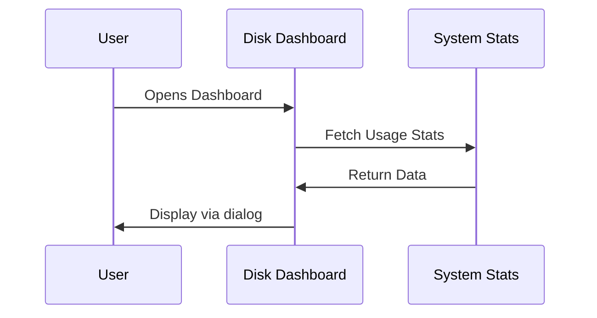

<div align="center">

# 🧹 Clean Space Dashboard  
### Terminal-Based File Organizer & Disk Monitoring Suite  


---

### 🧠 A Linux System Programming Team Project  
*A tidy home is a happy home, even if it's just your terminal.*

</div>

---

## 👥 Team Members

<div align="center">
  
<table>
<tr>
<td align="center">
  <b>Anmol</b><br>
  <sub>User Info & UI Design</sub>
</td>
<td align="center">
  <b>Jiya</b><br>
  <sub>File Organizer & Disk Dashboard</sub>
</td>
</tr>
<tr>
<td align="center">
  <b>Anshu Dhawan</b><br>
  <sub>System Monitoring & Alerts</sub>
</td>
<td align="center">
  <b>Damandeep Singh</b><br>
  <sub>System Monitoring & Documentation</sub>
</td>
</tr>
</table>

</div>

---

## 📋 Project Overview

**Clean Space Dashboard** is a feature-rich terminal utility that offers file organization, disk space monitoring, user tracking, and system alerts — all served on a platter of stylish `dialog` menus.  
Crafted for Linux power users who love order and despise clutter (and maybe just like pressing arrows in colorful boxes).

<div align="center">
  
</div>

---

## ✨ Key Features

<table>
<tr>
<td width="50%">

### 📁 **File Organizer**
- Organizes files by type (Images, Videos, Documents, etc.)
- Confirmation before overwriting existing files
- Logs every move in `organizer.log`
- Displays human-readable file sizes

### 📊 **Disk Dashboard**
- Monitors real-time storage with `df -h`
- Background alerts on usage thresholds
- System stats via `iostat`, `top`, `ncdu`, and `vmstat`

</td>
<td width="50%">

### 👥 **User Info**
- Displays current logged-in users using `who`
- Clean UI with `dialog` for navigation

### 🚨 **Live Alerts**
- Monitors root (`/`) partition every 5 minutes
- Sends broadcast warnings if space exceeds 80%
- Compatible with `wall` and `notify-send` for panic-mode notifications

</td>
</tr>
</table>

---

## 🗂️ Project Structure

```bash
organizer.sh     # Main Bash script
organizer.log    # Log file for file movements
README.md        # Documentation file (you’re reading it!)
```

---

## 🛠️ How It Works

### File Organizer Logic

```mermaid
flowchart TD
    A[Scan Current Directory] --> B[Detect File Types]
    B --> C[Prompt for Overwrite]
    C --> D[Move to Folders (Images, Docs...)]
    D --> E[Log Actions to organizer.log]
```

### Disk Usage Monitoring



---

## 🛠️ Setup & Usage

### Requirements

- Linux OS (Ubuntu/Debian recommended)
- `bash`
- `dialog`
- Optional but awesome: `ncdu`, `iostat`, `vmstat`, `notify-send`

### Installation Steps

```bash
sudo apt update
sudo apt install dialog ncdu sysstat
```

### Running the Dashboard

```bash
chmod +x organizer.sh
./organizer.sh
```

Let the tidying commence!

---

## 📚 Learning Outcomes

Through this project, our team gained real-world experience in:
- Bash scripting and file I/O
- System monitoring and process alerts
- User interaction via terminal-based UIs
- Team collaboration in a Unix environment
- Creating practical tools for end-users

---

## 🔮 Future Enhancements

- 📩 Email notifications for critical usage
- 📊 Web dashboard for remote monitoring
- 🗃️ Configurable folder types
- ♻️ Undo last move feature
- 🔔 Customizable alert thresholds

---

## 🤝 Acknowledgments

A big shoutout to our Linux System Programming faculty for turning us into terminal artists — and for giving us enough stress to want to *clean our file systems* in the first place.

---

<div align="center">
  
💡 *Built with pure Bash, occasional Ctrl+C panic, and terminal zen.*  
© 2025 Team Clean Space Dashboard  

</div>
